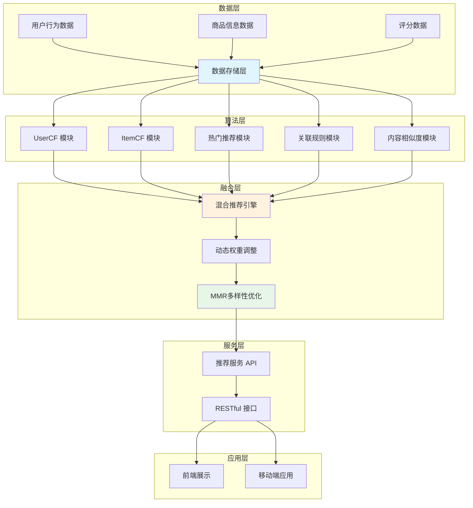
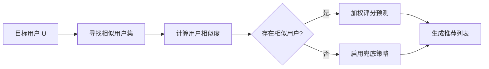
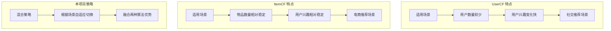
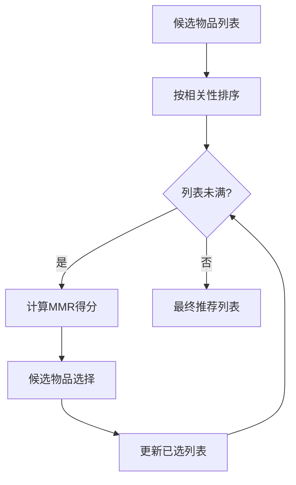

# 第2章 相关技术与理论基础

## 2.1 推荐系统概述

### 2.1.1 推荐系统的定义

推荐系统（Recommendation System）是一种信息过滤技术，旨在通过分析用户的历史行为数据，自动预测用户可能感兴趣的物品，并进行个性化推荐。随着互联网的快速发展，信息过载问题日益严重，推荐系统成为解决这一问题的核心技术之一。

推荐系统的主要目标是：在海量的信息和商品中，为用户筛选出其最可能感兴趣的内容，从而提升用户体验和平台的商业价值。

### 2.1.2 推荐系统的评价指标

推荐系统的性能评估是算法优化的重要依据。本项目采用以下核心评价指标：

**（1）精确率（Precision@K）**

精确率衡量推荐列表中相关物品的比例，其计算公式为：

$$
\text{Precision@K} = \frac{| \{ \text{相关物品}\} \cap \{ \text{推荐物品 Top-K}\} |}{K}
\tag{2-1}
$$

**（2）召回率（Recall@K）**

召回率衡量推荐系统能够覆盖到的相关物品的比例，其计算公式为：

$$
\text{Recall@K} = \frac{| \{ \text{相关物品}\} \cap \{ \text{推荐物品 Top-K}\} |}{| \{ \text{相关物品}\} |}
\tag{2-2}
$$

**（3）NDCG（Normalized Discounted Cumulative Gain）**

NDCG是考虑推荐列表排序质量的重要指标，它对排名靠前的正确推荐给予更高的权重：

$$
\text{DCG@K} = \sum_{i=1}^{K} \frac{2^{rel_i} - 1}{\log_2(i + 1)}
\tag{2-3}
$$

$$
\text{NDCG@K} = \frac{\text{DCG@K}}{\text{IDCG@K}}
\tag{2-4}
$$

其中，$rel_i$表示第$i$个推荐物品的相关度，IDCG为理想情况下的DCG值。

**（4）覆盖率（Coverage）**

覆盖率衡量推荐系统能够覆盖的物品占全部物品的比例：

$$
\text{Coverage} = \frac{| \{ \text{被推荐的物品} \} |}{| \{ \text{全部物品} \} |}
\tag{2-5}
$$

### 2.1.3 推荐系统架构

本项目采用分层架构设计，系统整体架构如图2-1所示。

**图2-1 推荐系统架构图**

---

## 2.2 协同过滤技术

协同过滤（Collaborative Filtering，CF）是推荐系统中最经典和广泛使用的算法之一。其核心思想是：具有相似偏好的用户会喜欢相似的物品，或者相似的物品会被相似的用户所喜欢。

### 2.2.1 基于用户的协同过滤（UserCF）

**（1）基本原理**

UserCF的核心思想是找到与目标用户相似的用户群体，然后根据这些相似用户对物品的评分来预测目标用户对未知物品的喜好程度。其基本流程如图2-2所示。

**图2-2 UserCF推荐流程图**

**（2）用户相似度计算**

用户相似度是UserCF算法的核心。常用的相似度计算方法有余弦相似度和皮尔逊相关系数。

余弦相似度的计算公式为：

$$
\text{sim}(u, v) = \frac{\sum_{i \in I_{uv}} r_{ui} \cdot r_{vi}}{\sqrt{\sum_{i \in I_{uv}} r_{ui}^2} \cdot \sqrt{\sum_{i \in I_{uv}} r_{vi}^2}}
\tag{2-6}
$$

其中，$I_{uv}$表示用户$u$和用户$v$共同评分过的物品集合，$r_{ui}$表示用户$u$对物品$i$的评分。

皮尔逊相关系数的计算公式为：

$$
\text{sim}(u, v) = \frac{\sum_{i \in I_{uv}} (r_{ui} - \bar{r}_u)(r_{vi} - \bar{r}_v)}{\sqrt{\sum_{i \in I_{uv}} (r_{ui} - \bar{r}_u)^2} \cdot \sqrt{\sum_{i \in I_{uv}} (r_{vi} - \bar{r}_v)^2}}
\tag{2-7}
$$

其中，$\bar{r}_u$和$\bar{r}_v$分别表示用户$u$和$v$的平均评分。

**（3）评分预测**

基于相似用户的评分预测公式为：

$$
\hat{r}_{ui} = \bar{r}_u + \frac{\sum_{v \in N_k(u)} \text{sim}(u, v) \cdot (r_{vi} - \bar{r}_v)}{\sum_{v \in N_k(u)} |\text{sim}(u, v)|}
\tag{2-8}
$$

其中，$N_k(u)$表示与用户$u$最相似的$k$个用户的集合。

### 2.2.2 基于物品的协同过滤（ItemCF）

**（1）基本原理**

ItemCF的核心思想是：用户喜欢的物品，与其相似的物品也可能被该用户喜欢。与UserCF相比，ItemCF具有更好的稳定性，适用于物品数量相对稳定的场景。

**图2-3 ItemCF推荐流程图**

**（2）物品相似度计算**

物品相似度的计算考虑用户行为的影响，公式为：

$$
\text{sim}(i, j) = \frac{\sum_{u \in U_{ij}} r_{ui} \cdot r_{uj}}{\sqrt{\sum_{u \in U_{ij}} r_{ui}^2} \cdot \sqrt{\sum_{u \in U_{ij}} r_{uj}^2}}
\tag{2-9}
$$

其中，$U_{ij}$表示同时评分过物品$i$和物品$j$的用户集合。

**（3）评分预测**

ItemCF的评分预测公式为：

$$
\hat{r}_{ui} = \frac{\sum_{j \in S_k(i)} \text{sim}(i, j) \cdot r_{uj}}{\sum_{j \in S_k(i)} |\text{sim}(i, j)|}
\tag{2-10}
$$

其中，$S_k(i)$表示与物品$i$最相似的$k$个物品的集合。

### 2.2.3 UserCF与ItemCF的对比

**表2-1 UserCF与ItemCF对比**

| 特性 | UserCF | ItemCF | 本项目 |
|------|--------|--------|--------|
| 复杂度 | $O(U^2 \cdot I)$ | $O(I^2 \cdot U)$ | 自适应 |
| 适用场景 | 用户少、兴趣变 | 物品少、稳定 | 混合使用 |
| 冷启动 | 新用户困难 | 新物品困难 | 多策略兜底 |
| 推荐多样性 | 较高 | 较低 | MMR优化 |

---

## 2.3 冷启动问题解决方案

冷启动（Cold Start）是推荐系统面临的经典挑战之一，指新用户或新物品缺乏历史数据，导致无法进行有效推荐的問題。

### 2.3.1 热门推荐兜底策略

**（1）策略原理**

当新用户没有任何历史行为数据时，系统采用热门物品推荐作为兜底策略。该策略根据物品的全局热度得分进行排序，确保推荐结果不会为空。

热门物品的热度得分计算公式为：

$$
\text{PopScore}(i) = \frac{\sum_{u \in U_i} r_{ui}}{|U_i|^{\alpha}} + \beta \cdot \text{recentness}(i)
\tag{2-11}
$$

其中，$U_i$表示对物品$i$有过评分行为的用户集合，$\alpha$为热度衰减参数，$\beta$为时效性权重，$\text{recentness}(i)$表示物品$i$的时效性得分。

**（2）随机扰动机制**

为避免热门推荐过于单一，本项目引入随机扰动因子：

$$
\hat{r}_{ui} = \text{PopScore}(i) \times (0.9 + \epsilon)
\tag{2-12}
$$

其中，$\epsilon \sim U(-0.1, 0.1)$为均匀分布的随机扰动。

**（3）类别多样性约束**

为保证推荐结果的多样性，限制同一类别物品的数量：

$$
| \{ i \in R \mid \text{category}(i) = c \} | \leq \lceil |R| \times 0.4 \rceil, \quad \forall c
\tag{2-13}
$$

其中，$R$为最终推荐列表，$|R|$为推荐列表长度。

### 2.3.2 目录级冷启动补齐

**（1）策略原理**

根据用户的历史偏好类别，为新用户推荐其偏好类别下的热门物品。该策略在热门推荐的基础上融入了初步的个性化元素。

偏好类别的计算公式为：

$$
\text{PreferenceScore}(u, c) = \omega_1 \cdot \frac{|R_{uc}|}{|R_u|} + \omega_2 \cdot \bar{r}_{uc} + \omega_3 \cdot \text{activity}(u)
\tag{2-14}
$$

其中，$R_{uc}$表示用户$u$在类别$c$下的评分记录，$|R_u|$为用户$u$的总评分记录数，$\bar{r}_{uc}$为该类别下的平均评分，$\text{activity}(u)$为用户活跃度因子。

**（2）动态权重调整**

本项目根据用户评分数量动态调整偏好权重：

$$
\omega_1 = 0.35 + 0.15 \times \text{sigmoid}\left(\frac{|R_u| - 10}{5}\right)
\tag{2-15}
$$

其中，sigmoid函数的定义为：

$$
\text{sigmoid}(x) = \frac{1}{1 + e^{-x}}
\tag{2-16}
$$

### 2.3.3 UserCF内部兜底机制

**（1）策略原理**

当UserCF算法无法找到足够的相似用户时（相似用户数量低于阈值），触发内部兜底机制。

**（2）融合内容相似度**

兜底策略融合用户历史偏好类别匹配和物品内容相似度：

$$
\hat{r}_{ui}^{\text{fallback}} = \lambda_1 \cdot \text{categoryMatch}(u, i) + \lambda_2 \cdot \text{contentSim}(u, i) + \lambda_3 \cdot \bar{r}_{\text{global}}
\tag{2-17}
$$

其中，$\lambda_1 + \lambda_2 + \lambda_3 = 1$，$\bar{r}_{\text{global}}$为全局平均评分。

---

## 2.4 数据稀疏性问题解决方案

数据稀疏性（Sparsity）是推荐系统面临的另一核心挑战。在大规模推荐场景中，用户-物品评分矩阵的稀疏度往往高达99%以上，严重影响协同过滤算法的效果。

### 2.4.1 混合推荐策略

**（1）策略原理**

本项目采用多策略加权融合的混合推荐方法，综合利用UserCF、ItemCF、热门推荐、关联规则和内容相似度等多种算法的优势。

混合推荐的核心公式为：

$$
\hat{r}_{ui}^{\text{hybrid}} = \sum_{k=1}^{K} w_k \cdot \hat{r}_{ui}^{(k)}
\tag{2-18}
$$

其中，$K$为参与的算法数量，$w_k$为第$k$个算法的权重，$\hat{r}_{ui}^{(k)}$为第$k$个算法的预测得分。

**（2）本项目权重配置**

本项目采用的混合权重配置如下：

| 算法 | 权重范围 | 说明 |
|------|----------|------|
| ItemCF | 0.30 ~ 0.45 | 主要推荐来源 |
| UserCF | 0.15 ~ 0.30 | 个性化补充 |
| 热门推荐 | 0.20 ~ 0.40 | 兜底保障 |
| 关联规则 | 0.08 ~ 0.12 | 购物车关联 |
| 内容相似度 | 0.05 ~ 0.20 | 冷启动增强 |

### 2.4.2 动态权重调整

**（1）连续权重映射函数**

传统分段函数在边界处存在跳变问题。本项目采用基于Sigmoid函数的连续权重映射，实现平滑过渡：

$$
w_k^{\text{dynamic}} = w_k^{\text{base}} + \Delta w_k \cdot \text{sigmoid}\left(\frac{|R_u| - \theta}{\phi}\right)
\tag{2-19}
$$

其中，$w_k^{\text{base}}$为算法$k$的基础权重，$\Delta w_k$为权重调节幅度，$\theta$为活性阈值，$\phi$为调节灵敏度。

**（2）用户活跃度标准化**

$$
\text{activity}_{\text{norm}}(u) = \min\left(1.0, \frac{|R_u|}{30}\right)
\tag{2-20}
$$

活跃度标准化后，sigmoid函数的计算为：

$$
\text{sigmoid}_{\text{activity}} = \frac{1}{1 + e^{-10 \cdot (\text{activity}_{\text{norm}} - 0.4)}}
\tag{2-21}
$$

### 2.4.3 相似度计算优化

**（1）动态最小重叠数阈值**

传统方法使用固定的MIN_OVERLAP阈值，在数据稀疏场景下容易引入噪声相似度。本项目根据用户活跃度动态调整：

$$
\text{MIN\_OVERLAP}(u) = \begin{cases}
2 & |R_u| < 10 \\
3 & 10 \leq |R_u| < 20 \\
5 & |R_u| \geq 20
\end{cases}
\tag{2-22}
$$

**（2）相似度收缩因子**

为降低小样本相似度的负面影响，引入收缩因子：

$$
\text{sim}_{\text{shrink}}(u, v) = \text{sim}(u, v) \times \frac{|I_{uv}|}{|I_{uv}| + \beta}
\tag{2-23}
$$

其中，$\beta$为收缩参数，本项目取值为25。

**（3）置信度加权**

相似度计算还需考虑重叠评分数和用户活跃度的影响：

$$
\text{confidence}(u, v) = 0.5 + 0.5 \times \left(\frac{\min(|R_u|, |R_v|)}{10}\right) \times \left(\frac{\min(|R_u|, |R_v|)}{\max(|R_u|, |R_v|)}\right)
\tag{2-24}
$$

最终相似度为：

$$
\text{sim}_{\text{final}}(u, v) = \text{sim}_{\text{shrink}}(u, v) \times \text{confidence}(u, v)
\tag{2-25}
$$

---

## 2.5 推荐多样性优化

推荐多样性（Diversity）是衡量推荐系统质量的重要指标。多样性的缺失会导致用户产生"千篇一律"的体验，降低推荐系统的实用价值。

### 2.5.1 MMR算法原理

**（1）问题定义**

在推荐列表生成过程中，需要平衡两个目标：推荐物品与用户的相关性，以及推荐列表的多样性。这两个目标往往存在冲突。

**（2）MMR公式**

MMR（Maximal Marginal Relevance，最大边际相关性）算法通过以下公式平衡两个目标：

$$
\text{MMR} = \lambda \cdot \text{relevance}(c, G) - (1-\lambda) \cdot \max_{s \in S} \text{similarity}(c, s)
\tag{2-26}
$$

其中，$\lambda$为平衡参数（取值范围0~1），$c$为候选物品，$G$为用户偏好画像，$S$为已选中的推荐列表，$\text{similarity}(c, s)$为物品间的相似度。

**（3）本项目的MMR实现**

本项目采用类别相似度作为冗余度度量：

$$
\text{similarity}(c, s) = \begin{cases}
0.8 & \text{category}(c) = \text{category}(s) \\
0.1 & \text{otherwise}
\end{cases}
\tag{2-27}
$$

同时引入位置衰减权重：

$$
\text{position\_weight}(i) = 1.0 - 0.1 \times \min(i, 5)
\tag{2-28}
$$

考虑位置权重的MMR公式为：

$$
\text{MMR}_{\text{position}} = \lambda \cdot \text{relevance}(c) \cdot \text{position\_weight}(|S|) - (1-\lambda) \cdot \max_{s \in S} \text{similarity}(c, s)
\tag{2-29}
$$

### 2.5.2 类别多样性约束

在MMR算法的基础上，本项目还增加了硬性的类别多样性约束：

$$
\forall c \in \text{Categories}: \quad |\{ i \in R \mid \text{category}(i) = c \}| \leq \left\lceil \frac{|R|}{N_c} \times 0.4 \right\rceil
\tag{2-30}
$$

其中，$N_c$为类别总数，0.4为单类别占比上限。

### 2.5.3 多样性优化流程

**图2-4 多样性优化流程图**

---

## 2.6 本章小结

本章详细介绍了本项目所涉及的相关技术与理论基础。主要包括：

（1）**推荐系统概述**：介绍了推荐系统的定义和评价指标，为后续算法评估奠定基础。

（2）**协同过滤技术**：深入分析了UserCF和ItemCF的原理、相似度计算方法和评分预测公式，并对比了两种算法的适用场景。

（3）**冷启动问题解决方案**：提出了热门推荐兜底、目录级冷启动补齐和UserCF内部兜底三种策略，并通过随机扰动和类别约束提升推荐多样性。

（4）**数据稀疏性问题解决方案**：采用混合推荐策略融合多种算法，通过动态权重调整和相似度计算优化提升推荐质量。

（5）**推荐多样性优化**：引入MMR算法平衡相关性与多样性，结合类别多样性约束和位置衰减权重，实现多样性与准确性的统一。

上述技术为后续章节的系统设计和实现提供了坚实的理论基础。
