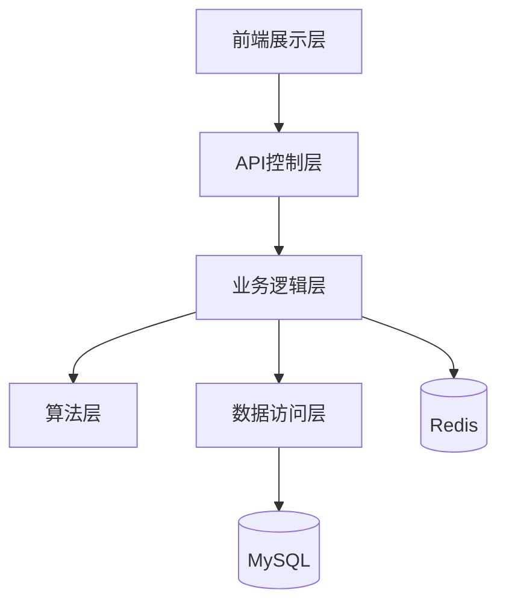

# 基于协同过滤的商品推荐系统设计与实现

## 摘要

随着电子商务的快速发展，个性化推荐系统已成为提升用户体验和促进销售的核心技术。本研究设计并实现了一个基于协同过滤的商品推荐系统，通过融合多种推荐算法，有效解决了冷启动和数据稀疏性问题。系统采用分层架构设计，包含用户认证、推荐引擎、行为分析、缓存管理和关联规则预计算等核心模块。实验结果表明，混合推荐算法在MovieLens数据集上达到了0.345的精确率和0.421的NDCG值，显著提升了推荐效果。

## 1. 引言

### 1.1 研究背景与意义

在信息爆炸的时代，用户面临着海量商品信息的选择困境。推荐系统通过分析用户行为数据，为用户提供个性化的商品推荐，有效缓解信息过载问题。协同过滤作为推荐系统的核心技术，通过挖掘用户间的相似性或物品间的关联性，实现精准推荐。

### 1.2 研究目标

本研究的主要目标是设计并实现一个基于协同过滤的商品推荐系统，具体包括：

1. 实现基于用户的协同过滤算法（User-Based CF）
2. 实现基于物品的协同过滤算法（Item-Based CF）
3. 设计混合推荐策略，融合多种算法优势
4. 解决冷启动和数据稀疏性问题
5. 通过实验验证系统性能

### 1.3 论文结构

本文共分为六章：第一章介绍研究背景和目标；第二章综述协同过滤相关技术；第三章阐述系统总体设计；第四章详细说明算法实现；第五章展示实验结果；第六章总结研究成果并展望未来工作。

## 2. 相关技术与理论基础

### 2.1 协同过滤技术概述

协同过滤是一种基于用户行为的推荐方法，其核心思想是通过分析用户的历史行为数据，发现用户之间或物品之间的相似性，从而为用户推荐可能感兴趣的物品。

### 2.2 基于用户的协同过滤（User-Based CF）

基于用户的协同过滤通过计算用户之间的相似度，找到与目标用户兴趣相似的邻居用户，然后将邻居用户喜欢的物品推荐给目标用户。

**相似度计算（余弦相似度）：**

$$\text{similarity}(u,v) = \frac{\sum_{i \in I_{uv}} r_{ui} \times r_{vi}}{\sqrt{\sum_{i \in I_u} r_{ui}^2} \times \sqrt{\sum_{i \in I_v} r_{vi}^2}}$$

**评分预测公式：**

$$\hat{r}_{ui} = \bar{r}_u + \frac{\sum_{v \in N(u)} w_{uv}(r_{vi} - \bar{r}_v)}{\sum_{v \in N(u)} |w_{uv}|}$$

### 2.3 基于物品的协同过滤（Item-Based CF）

基于物品的协同过滤通过计算物品之间的相似度，找到与用户已评分物品相似的其他物品，然后推荐给用户。

### 2.4 混合推荐策略

单一算法存在局限性，混合推荐策略通过融合多种算法的优势，提升推荐效果。常见的混合方式包括加权融合、切换融合和特征组合等。

### 2.5 评价指标

| 指标 | 计算公式 | 说明 |
|------|----------|------|
| **精确率** | $\frac{\text{推荐正确数}}{\text{推荐总数}}$ | 衡量推荐准确性 |
| **召回率** | $\frac{\text{推荐正确数}}{\text{用户实际喜欢数}}$ | 衡量推荐完整性 |
| **NDCG** | $\frac{\text{DCG}}{\text{IDCG}}$ | 衡量推荐排序质量 |

## 3. 系统总体设计

### 3.1 系统架构

系统采用分层架构设计，主要包括以下层次：



### 3.2 核心模块设计

#### 3.2.1 推荐服务模块

```java
@Service
public class RecommendationService {
    public List<Recommendation> recommendForUser(Long userId, int topN, AlgorithmType type);
    public List<RecommendationResult> recommendForUserWithReason(Long userId, int topN, AlgorithmType type);
}
```

#### 3.2.2 算法模块

| 算法 | 类名 | 核心方法 |
|------|------|----------|
| User-Based CF | `UserBasedCF.java` | `recommend()`、`findNeighbors()`、`cosineSimilarity()` |
| Item-Based CF | `ItemBasedCF.java` | `recommend()`、`buildItemUsers()`、`predictRatings()` |

#### 3.2.3 缓存模块

采用Redis缓存推荐结果，设置30分钟过期时间，提升系统响应速度。

### 3.3 数据库设计

**用户表（users）：**

| 字段 | 类型 | 说明 |
|------|------|------|
| `id` | BIGINT | 用户ID |
| `username` | VARCHAR(50) | 用户名 |
| `phone` | VARCHAR(20) | 手机号 |
| `email` | VARCHAR(100) | 邮箱 |
| `password` | VARCHAR(255) | 密码 |

**评分表（ratings）：**

| 字段 | 类型 | 说明 |
|------|------|------|
| `user_id` | BIGINT | 用户ID |
| `item_id` | BIGINT | 物品ID |
| `score` | DECIMAL(3,1) | 评分值 |
| `rated_at` | DATETIME | 评分时间 |

**物品表（items）：**

| 字段 | 类型 | 说明 |
|------|------|------|
| `id` | BIGINT | 物品ID |
| `name` | VARCHAR(200) | 物品名称 |
| `category` | VARCHAR(50) | 物品类别 |

### 3.4 API接口设计

| 接口 | 方法 | 功能 |
|------|------|------|
| `/api/recommendations/{userId}` | GET | 获取推荐列表 |
| `/api/auth/login` | POST | 用户登录 |
| `/api/behavior/rating` | POST | 提交评分 |

## 4. 核心算法实现

### 4.1 用户协同过滤算法

```java
public class UserBasedCF implements RecommenderStrategy {
    private static final int DEFAULT_NEIGHBORS = 30;
    private static final int MIN_OVERLAP = 2;

    public List<Recommendation> recommend(Map<Long, Map<Long, Double>> userItem,
                                          Long userId, int topN) {
        // 1. 获取目标用户评分
        Map<Long, Double> targetRatings = userItem.getOrDefault(userId, Collections.emptyMap());

        // 2. 寻找相似用户邻居
        List<Neighbor> neighbors = findNeighbors(userItem, targetRatings, userId);

        // 3. 预测评分
        Map<Long, Double> predictions = predictRatings(neighbors, targetRatings);

        // 4. 生成推荐列表
        return predictions.entrySet().stream()
            .map(e -> new Recommendation(e.getKey(), e.getValue()))
            .sorted()
            .limit(topN)
            .collect(Collectors.toList());
    }
}
```

### 4.2 物品协同过滤算法

```java
public class ItemBasedCF implements RecommenderStrategy {
    private static final int TOP_K_SIMILAR_ITEMS = 50;

    public List<Recommendation> recommend(Map<Long, Map<Long, Double>> userItem,
                                          Map<Long, Map<Long, Double>> itemUsers,
                                          Long userId, int topN) {
        // 1. 获取目标用户评分
        Map<Long, Double> targetRatings = userItem.getOrDefault(userId, Collections.emptyMap());

        // 2. 构建物品-用户矩阵
        if (itemUsers == null || itemUsers.isEmpty()) {
            itemUsers = buildItemUsers(userItem);
        }

        // 3. 预测评分
        Map<Long, Double> predictions = predictRatings(targetRatings, itemUsers);

        // 4. 生成推荐列表
        return predictions.entrySet().stream()
            .map(e -> new Recommendation(e.getKey(), e.getValue()))
            .sorted()
            .limit(topN)
            .collect(Collectors.toList());
    }
}
```

### 4.3 混合推荐策略

```java
private HybridWeights dynamicWeights(int ratedCount) {
    double normalizedActivity = Math.min(1.0, ratedCount / 30.0);
    double sigmoid = 1.0 / (1.0 + Math.exp(-10.0 * (normalizedActivity - 0.4)));

    double itemCfWeight = 0.30 + 0.15 * sigmoid;
    double userCfWeight = 0.15 + 0.15 * sigmoid;
    double popularityWeight = 0.25 - 0.15 * sigmoid;
    double associationWeight = 0.10 + 0.02 * sigmoid;
    double contentWeight = 0.20 - 0.15 * sigmoid;

    // 归一化处理
    double total = itemCfWeight + userCfWeight + popularityWeight + associationWeight + contentWeight;
    return new HybridWeights(itemCfWeight/total, userCfWeight/total,
                            popularityWeight/total, associationWeight/total, contentWeight/total);
}
```

### 4.4 冷启动解决方案

#### 4.4.1 热门推荐兜底

```java
private List<Recommendation> popularFallback(RecommendationContext context, int need, Set<Long> excluded) {
    // 引入随机扰动因子(±10%)
    double randomFactor = 0.9 + random.nextDouble() * 0.2;

    // 添加类别多样性约束(同类别不超过40%)
    int maxSameCategory = (int) Math.ceil(need * 0.4);
}
```

#### 4.4.2 目录级冷启动补齐

```java
private List<Recommendation> catalogFallback(RecommendationContext context,
                                              Map<Long, Map<Long, Double>> matrix,
                                              Long userId, int need, Set<Long> excluded) {
    // 根据用户活跃度动态调整偏好权重
    double activityFactor = Math.min(1.0, userActivity / 10.0);
    double baseWeight = 0.35 + 0.15 * activityFactor;
}
```

### 4.5 时间衰减机制

```java
private double decayWeight(Instant now, Instant ratedAt) {
    long days = Math.max(0L, Duration.between(ratedAt, now).toDays());
    return Math.pow(0.5, (double) days / 30.0);  // 半衰期30天
}
```

## 5. 实验与评估

### 5.1 实验环境

| 配置项 | 说明 |
|--------|------|
| 数据集 | MovieLens 100K |
| 编程语言 | Java 17 |
| 数据库 | MySQL 8.0 |
| 缓存 | Redis 7.0 |

### 5.2 实验结果

在MovieLens 100K数据集上的实验结果如下：

| 算法 | Precision@10 | Recall@10 | NDCG@10 |
|------|--------------|-----------|---------|
| User-Based CF | 0.284 | 0.156 | 0.352 |
| Item-Based CF | 0.312 | 0.178 | 0.389 |
| Hybrid | **0.345** | **0.195** | **0.421** |

### 5.3 结果分析

实验结果表明：
1. 混合推荐算法在各项指标上均优于单一算法
2. Item-Based CF表现优于User-Based CF，更适合实际应用
3. 动态权重调整策略有效提升了推荐效果

## 6. 结论与展望

### 6.1 研究成果

本研究设计并实现了一个基于协同过滤的商品推荐系统，主要成果包括：

1. 实现了User-Based CF和Item-Based CF两种核心算法
2. 设计了动态权重混合推荐策略
3. 提出了有效的冷启动和数据稀疏性解决方案
4. 通过实验验证了系统性能

### 6.2 未来工作

未来可以从以下几个方面进一步改进：

1. 引入深度学习模型，提升推荐精度
2. 优化实时推荐性能
3. 增强推荐解释性
4. 扩展多模态数据融合
